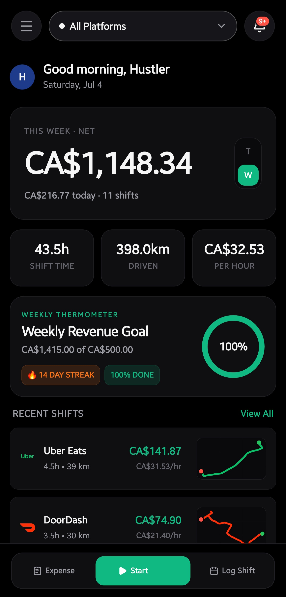
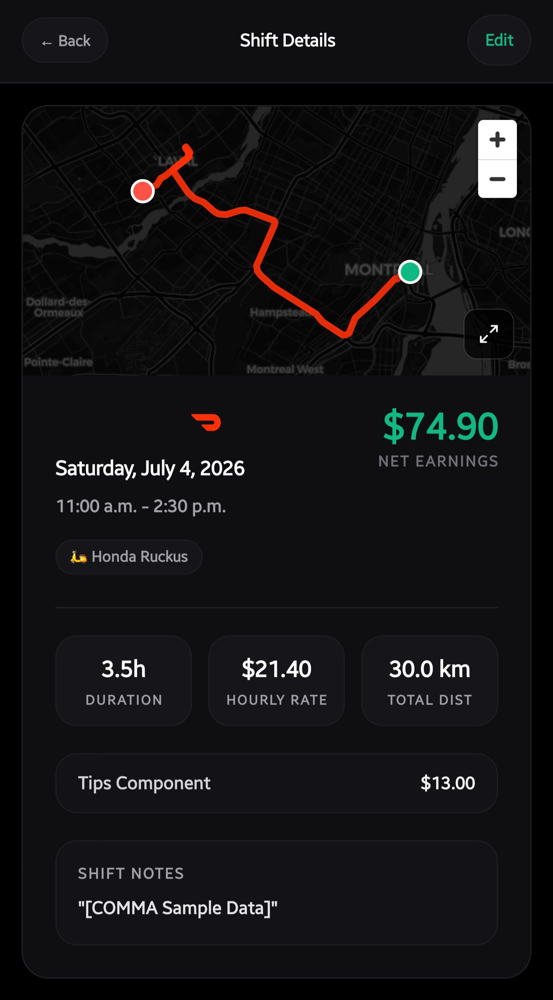
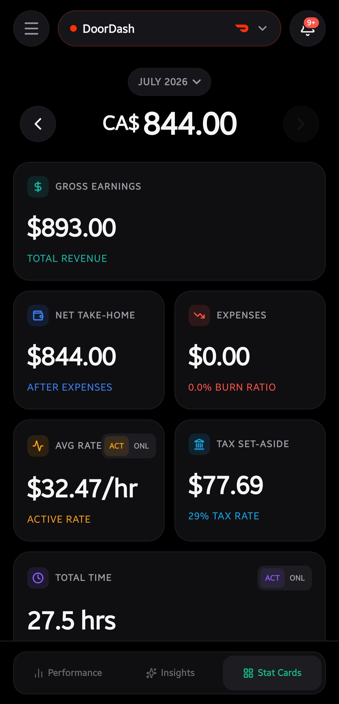
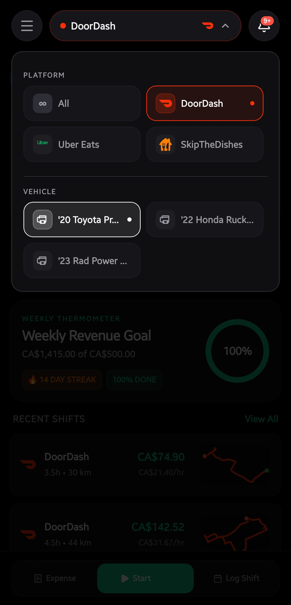
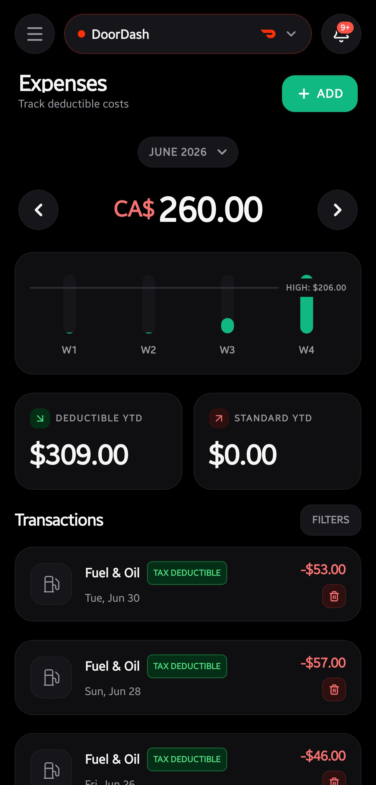
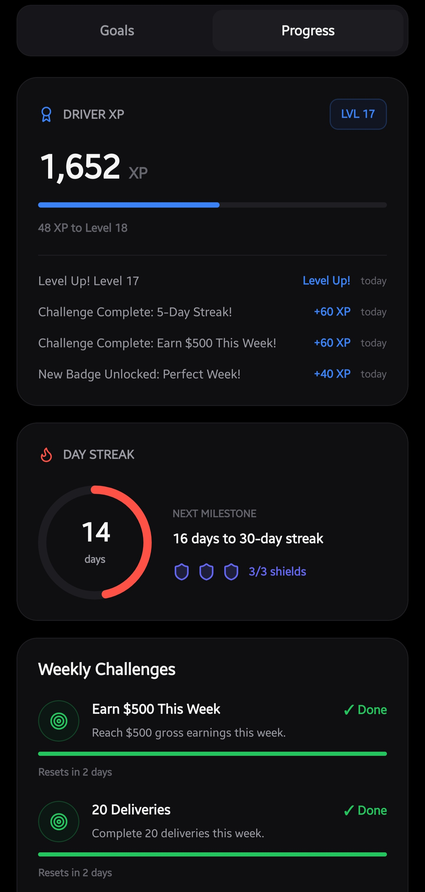
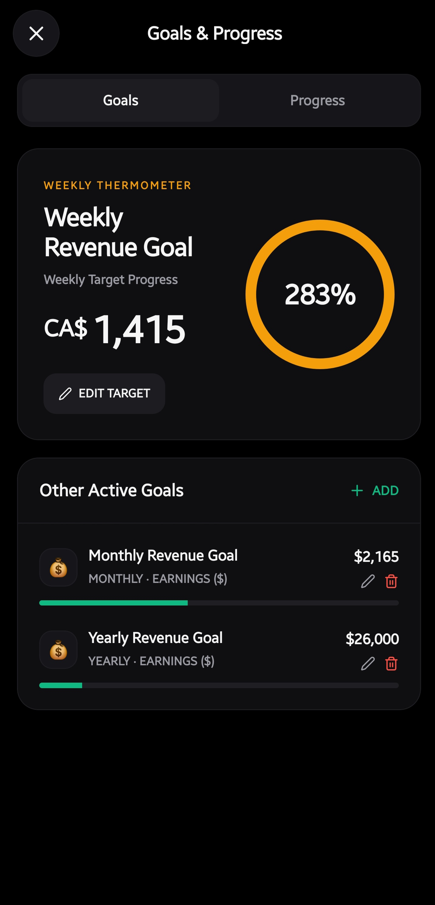
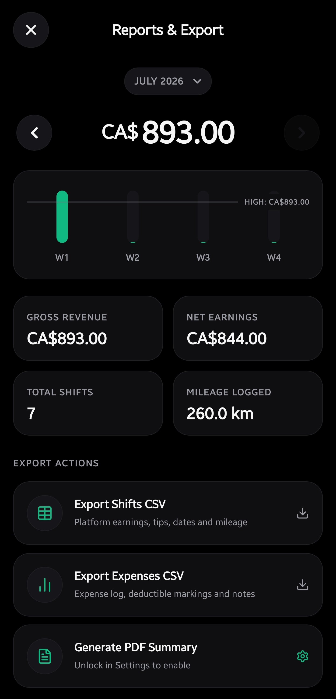

# Comma

[](https://github.com/raiz-toff/CommaApp/releases/latest)
[](LICENSE)
[](https://comma-docs.vercel.app)

Earnings tracker for gig workers. Tracks shifts, mileage, expenses, and gives tax estimates. Everything stays on your phone — no account, no cloud unless you want it.

Built for DoorDash, Uber Eats, SkipTheDishes, Instacart, Amazon Flex, and others.

**[Download for Android](https://github.com/raiz-toff/CommaApp/releases/latest)** · **[Open the web app](https://comma-psi.vercel.app)** · **[Read the docs](https://comma-docs.vercel.app)**

## One repo, three faces

Everything lives in this repository — the phone app, the web app, and the docs.

- **Phone app** (repo root) — the native Android/iOS app, with background GPS mileage tracking. Grab the APK from [Releases](https://github.com/raiz-toff/CommaApp/releases/latest).
- **Web app** ([`web/`](web/)) — an installable PWA at [comma-psi.vercel.app](https://comma-psi.vercel.app) for logging and reviewing from a laptop. Vanilla JS, no server, data stays in your browser. Has its own [README](web/README.md) and [contributing guide](web/CONTRIBUTING.md).
- **Docs** ([`docs/`](docs/)) — user guides and architecture notes, published at [comma-docs.vercel.app](https://comma-docs.vercel.app) via the [`docs-site/`](docs-site/) Nextra app.

The two apps share the same backup format, so a vault can move between them.

## Screenshots

<table width="100%">
  <tr>
    <td width="33%" align="center">
      <strong>Dashboard</strong><br/>
      <br/>
      <em>Weekly net at a glance — earnings, hours, kilometres, and your real hourly rate.</em>
    </td>
    <td width="33%" align="center">
      <strong>Shift Details</strong><br/>
      <br/>
      <em>Every tracked shift keeps its GPS route, duration, rate, distance, and tips.</em>
    </td>
    <td width="33%" align="center">
      <strong>Analytics</strong><br/>
      <br/>
      <em>Gross vs. net take-home, burn ratio, active vs. online rate, and tax set-aside.</em>
    </td>
  </tr>
  <tr>
    <td width="33%" align="center">
      <strong>Platforms &amp; Vehicles</strong><br/>
      <br/>
      <em>Filter everything by platform, and switch between your car, scooter, or e-bike.</em>
    </td>
    <td width="33%" align="center">
      <strong>Expenses</strong><br/>
      <br/>
      <em>Log costs as you go — deductible items are flagged and totalled for tax time.</em>
    </td>
    <td width="33%" align="center">
      <strong>Goals &amp; Streaks</strong><br/>
      <br/>
      <em>Driver XP, day streaks with shields, and weekly challenges to keep you moving.</em>
    </td>
  </tr>
  <tr>
    <td width="33%" align="center">
      <strong>Goals</strong><br/>
      <br/>
      <em>Weekly, monthly, and yearly revenue targets with live progress.</em>
    </td>
    <td width="33%" align="center">
      <strong>Reports &amp; Export</strong><br/>
      <br/>
      <em>Monthly summaries, plus one-tap CSV exports of shifts and expenses.</em>
    </td>
    <td width="33%" align="center">
      <strong>Vehicles</strong><br/>
      <br/>
      <em>Manage your fleet — mileage and costs are tracked per vehicle.</em>
    </td>
  </tr>
</table>

## Stack

- Expo SDK 56 + Expo Router
- SQLite via Drizzle ORM
- Zustand + TanStack React Query
- NativeWind v4

## Running locally

```bash
npm install
npx expo start
```

For an Android APK:

```bash
./build-android.sh
```

You need the Android SDK. Set the path in `android/local.properties`:

```
sdk.dir=/path/to/android-sdk
```

## Google Drive backup (optional)

Create a Web OAuth client in Google Cloud Console and add your client ID to `.env`:

```
GOOGLE_WEB_CLIENT_ID=your-client-id
```

See `.env.example`.

## Contributing

Fix a bug, open a PR. Keep TypeScript strict — no `any`. DB queries go through Drizzle, no JS array processing on DB results. Details in [CONTRIBUTING.md](CONTRIBUTING.md) and the [development docs](https://comma-docs.vercel.app/development/setup).

## License

[MIT](LICENSE)
