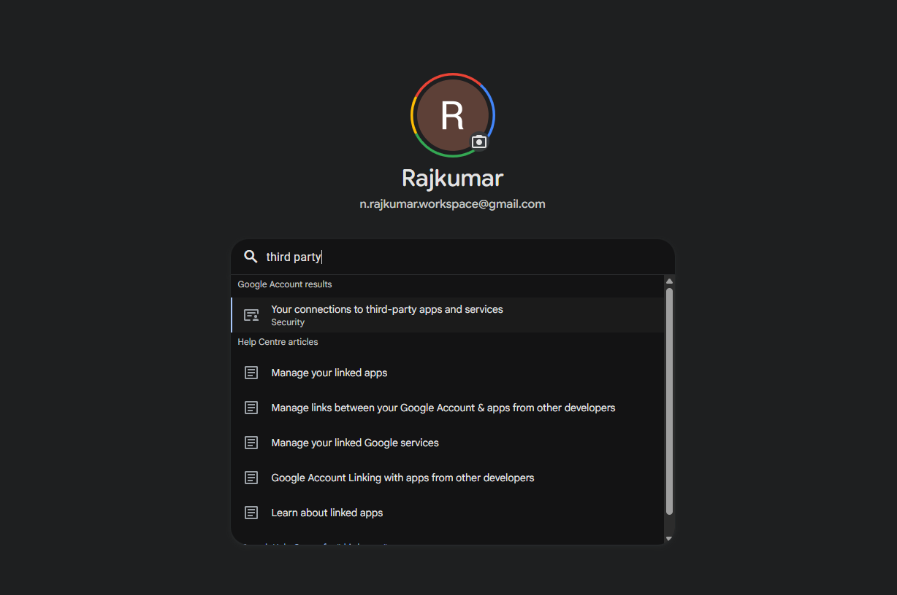
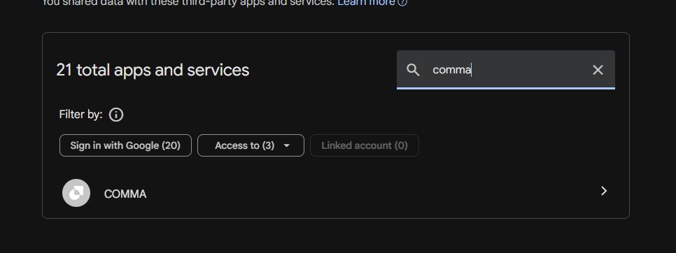
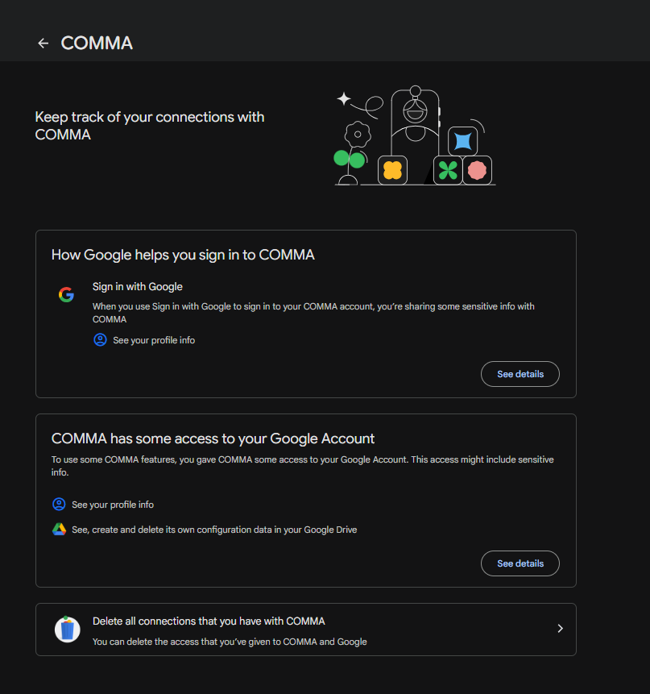

# Fixing Google Drive connection

Sometimes Cloud Sync stops working and shows an error like **"Your Google Drive session expired"** or refuses to connect at all — even though you just signed in. This almost always means Google is letting you sign in but not letting the app reach your Drive. The fix lives in your Google account, and it takes about a minute.

<StepFlow accent="amber" steps={[{ title: "Search your Google account", body: "At myaccount.google.com, search “third party” and open Your connections to third-party apps and services." }, { title: "Remove Comma's access", body: "Find Comma in the list, open it, and choose Remove access." }, { title: "Reconnect in the app", body: "Settings → Cloud Sync → Connect Google Drive, then grant access." }]} caption="Revoking and re-granting forces Google to hand the app a fresh, working key." />

---

## First, try a reconnect

If the error says your **session expired**, the quickest fix is to reconnect:

1. Go to **Settings → Cloud Sync**.
2. Turn Cloud Sync **off** (Disconnect), then **Connect Google Drive** again.
3. Sign in and let it sync.

A reconnect refreshes the short-lived key Comma uses to reach your Drive. If that clears it, you are done.

---

## Still failing right after you sign in? Remove and re-grant access

If reconnecting does not help — especially if it fails the *instant* you connect, and a brand-new Google account works fine — the account's stored permission for Comma has gone stale. Reconnecting reuses that same stale permission, so it keeps failing. You have to clear it on Google's side and grant it fresh:

1. On any device, sign in at **[myaccount.google.com](https://myaccount.google.com)** with the account Comma uses.
2. Search **"third party"** at the top and open **Your connections to third-party apps and services** (under Security).

   

3. In that page's own search box, type **"comma"**, then open the **COMMA** entry that appears — it is listed under **Access to**, because it holds a Drive permission.

   

4. At the bottom of the COMMA page, choose **Delete all connections that you have with COMMA**, and confirm on the next screen. (Higher up, the page shows the one Drive permission it is removing — *"See, create and delete its own configuration data in your Google Drive"* — which is Comma's private app folder, not the rest of your Drive.)

   

5. Go back to the app: **Settings → Cloud Sync → Connect Google Drive**.
6. This time Google shows the **consent screen** again. Grant access.

That fresh grant restores Comma's private-folder permission, and sync works again. Your data is untouched by this — you are only re-approving the connection, not changing what is stored.

---

## Check your phone's date and time

A phone whose clock is wrong will have Google reject its access key as "expired" the moment it is issued — the same session-expired error, with no amount of reconnecting able to fix it.

On the phone: **Settings → System → Date & time**, and turn on **use network-provided time** (automatic). Then reconnect Comma.

---

## Use the same Google account everywhere

Comma stores your vault in a private folder tied to **one** Google account. A phone signed into one account and a browser signed into another are looking at two different, empty folders — which reads as "nothing to sync" rather than an error, but is worth ruling out.

Make sure every device you want in sync is connected to the **same** Google account. You can check which one on each device under **Settings → Cloud Sync** — the connected email is shown there.

---

## What Comma can and cannot see

None of the above gives Comma access to the rest of your Google account. It requests only the `drive.appdata` scope: a hidden, per-app folder that does not appear in your Drive and that no other app can read. It cannot see your documents, your photos, or your email. Removing and re-granting access does not change that — it only refreshes permission to that one private folder.

For how sync and backup work in full, see [Cloud Sync](./cloud-sync.md) and [Google Drive Backup](./google-drive-backup.md). If you protect your vault with a backup password, [Encryption](./encryption.md) covers what happens if you forget it.
