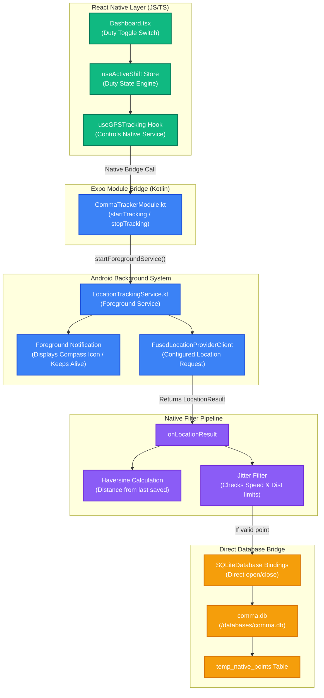

# CommaApp GPS & Native Background Tracking Architecture

This document provides a detailed overview and conceptual mind map of the background location tracking system in CommaApp.

---

## 1. Core Objectives & System Benefits

Historically, tracking mileage in background states using pure JavaScript (React Native) is prone to:
1. **Battery Drain**: High CPU wake cycles to process coordinates in the JS context.
2. **Data Loss**: The Android OS aggressively suspends/kills the JS engine when the phone is locked.
3. **Bridge Bottlenecks**: Passing batch coordinate records from native Java/C++ layers over the React Native bridge causes lag.

To address this, we transitioned the tracking engine to a **native Android implementation** in Kotlin that handles updates entirely on the native side:

* **Hardware Batching**: Uses the low-power Fused Location provider to batch updates.
* **Native Filter**: Checks jitter and distance math instantly on the native thread.
* **Direct Database Bridge**: Accesses the SQLite file directly in Java to insert points, running completely independently of whether the React Native Javascript thread is active or suspended.

---

## 2. Technical Mind Map

The following Mermaid diagram maps the flow of control and data:

---

## 3. Detailed Component Breakdown

### A. Location Client Configuration (Hardware Batching)
The background updates are managed using `LocationRequest` with power-optimized batch intervals:
- **Interval (`10000ms`)**: Checks location every 10 seconds.
- **Min Update Distance (`20f`)**: Coordinates are only sent if the driver moved at least 20 meters.
- **Max Delay (`30000ms`)**: Hardware batches up to 30 seconds of location events before triggering our callback. This allows the system CPU to remain in low-power sleep states while driving.

### B. Haversine & Jitter Filtering
To ensure clean routes and prevent false mileage collection, coordinates pass through two native math filters:
1. **Haversine Distance**: Calculates the distance $d$ between the last stored coordinate $(lat_1, lon_1)$ and the incoming coordinate $(lat_2, lon_2)$:
   $$d = 2R \arcsin\left(\sqrt{\sin^2\left(\frac{\Delta \phi}{2}\right) + \cos(\phi_1)\cos(\phi_2)\sin^2\left(\frac{\Delta \lambda}{2}\right)}\right)$$
   Where $R = 6371\text{ km}$. If distance is less than **20 meters**, the point is ignored (stationary filtering).
2. **Speed-Based Jitter Filtering**: Calculates velocity based on coordinate timestamp delta:
   $$\text{Speed} = \frac{\text{Distance}}{\Delta\text{Time}}$$
   If speed exceeds **42 m/s** (roughly 150 km/h or 94 mph), the point is classified as a GPS jitter spike and is safely discarded.

### C. Direct SQLite Database Insertion
When a coordinate passes the filters, the service directly accesses the app's internal SQLite database:
1. Resolves the database path using `context.getDatabasePath("comma.db")`.
2. Opens the connection using `SQLiteDatabase.openDatabase` in read/write mode.
3. Inserts `lat`, `lon`, and `timestamp` into the `temp_native_points` table using optimized Android `ContentValues` bindings.
4. Closes the connection immediately to preserve resource safety.

---

## 4. Current Work Done & Status

1. **Kotlin Service Implemented**: Fully defined [LocationTrackingService.kt](file:///home/coder/Production/commaApp/modules/comma-tracker/android/src/main/java/expo/modules/commatracker/LocationTrackingService.kt).
2. **Bridge Exposed**: Wired [CommaTrackerModule.kt](file:///home/coder/Production/commaApp/modules/comma-tracker/android/src/main/java/expo/modules/commatracker/CommaTrackerModule.kt) to hook into the React Native runtime.
3. **Database Migration Linked**: Created the `temp_native_points` schema in Drizzle and verified the database initialization.
4. **Android Build Verified**: Fixed Kotlin module DSL labeled returns. Successfully compiled the debug APK locally via gradle (`BUILD SUCCESSFUL in 3m 30s`).
