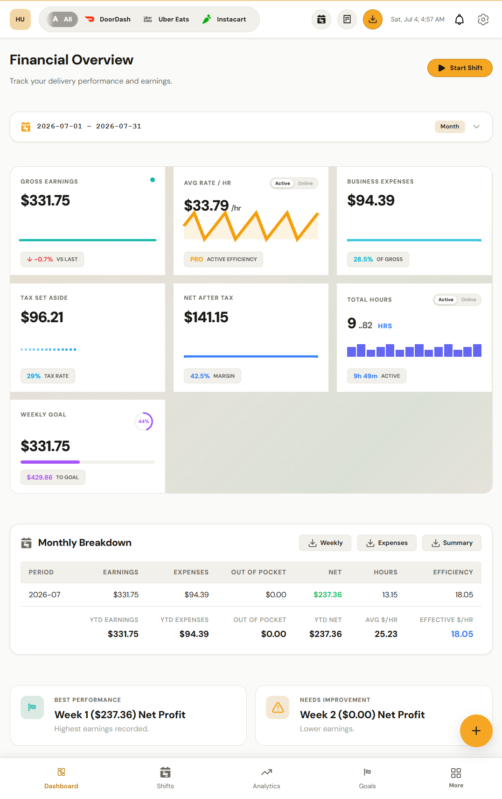
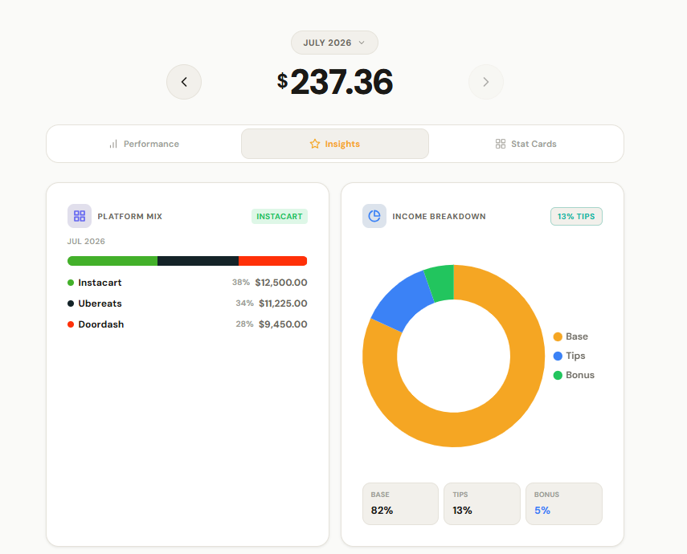
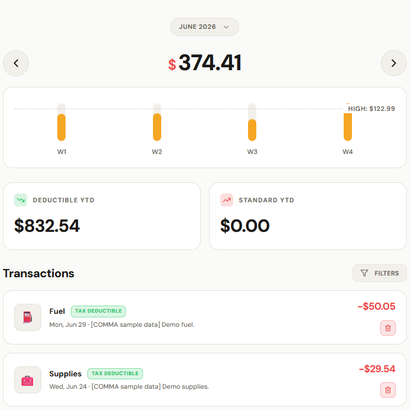
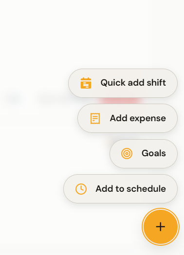

<div align="center">
  
  <h1>COMMA</h1>
  <p><strong>A fast, local-first earnings tracker built exclusively for gig economy delivery drivers.</strong></p>

  [](https://opensource.org/licenses/MIT)
  [](https://esbuild.github.io/)
  [](https://comma-psi.vercel.app)

  <strong><a href="https://comma-psi.vercel.app">Open COMMA</a></strong> ·
  <strong><a href="https://comma-docs.vercel.app">User Docs</a></strong> ·
  <strong><a href="https://github.com/raiz-toff/CommaApp/releases/latest">Android App (APK)</a></strong>
</div>

> [!WARNING]  
> **Currently in Active Development**  
> COMMA's core engine is fully functional, but currently **only Ontario (Canada) is officially added** to the market registry. Other provinces, states, and countries are not yet added. We highly encourage and thank you for any contributions to add your local region's tax rules and platforms! (See the docs below on how to add a country/province).

---

## What is COMMA?

COMMA is an advanced, offline-first dashboard for multi-apping delivery drivers (DoorDash, Uber Eats, Skip, Instacart, etc.). It helps you track your true net hourly rate, vehicle expenses, tax obligations, and goal streaks—all without your data ever leaving your device.

By treating gig work like a real business, COMMA gives you the same analytics an office worker takes for granted, tailored to the realities of delivery logistics.

---

## App Interface

### Financial Overview
The heart of COMMA. Gross earnings, average hourly rate, business expenses, tax set-aside, and net after tax — filterable by platform and date range, with a monthly breakdown table and one-click exports.



<table width="100%">
  <tr>
    <td width="38%" align="center">
      <strong>Analytics Insights</strong><br/>
      <br/>
      <em>See your platform mix at a glance, and how much of your income is base pay vs. tips vs. bonuses.</em>
    </td>
    <td width="38%" align="center">
      <strong>Expense Tracking</strong><br/>
      <br/>
      <em>Weekly spending bars, deductible year-to-date totals, and tax-deductible flags per transaction.</em>
    </td>
    <td width="24%" align="center">
      <strong>Quick Add</strong><br/>
      <br/>
      <em>Log a shift, expense, goal, or schedule entry from anywhere.</em>
    </td>
  </tr>
</table>

---

## Features

* **Multi-App Intelligence**: Define which platforms you run. COMMA understands their unique terms (Peak Pay vs. Surge) and provides platform-specific form fields.
* **True Net Earnings**: Auto-calculates your real hourly rate after fuel, maintenance, and vehicle depreciation.
* **Tax Peace of Mind**: Computes suggested tax set-asides based on your region, handles Canadian HST tracking, and isolates deductible business expenses.
* **Gamification & Goals**: Set weekly earnings targets, maintain streaks, and unlock achievement badges.
* **100% Offline & Private**: Built on IndexedDB and a custom Service Worker. It works in dead zones, and your financial data never hits a cloud server.
* **Blazing Fast**: Vanilla JavaScript and CSS. Zero framework overhead.

---

## Quick Start

Requires [Node.js](https://nodejs.org/) (v18+) solely for the local build server.

```bash
# 1. Clone the repository (the web app lives in web/)
git clone https://github.com/raiz-toff/CommaApp.git
cd CommaApp/web

# 2. Install dev dependencies (esbuild)
npm install

# 3. Start the dev server in watch mode
npm run dev
```

Open `http://localhost:3000` (or whatever port `serve` assigns) in your browser.

> **Tip:** You can install COMMA as a standalone app on your phone or desktop directly from your browser (PWA).

---

## Tech Stack

COMMA is an exercise in stripping away modern web bloat:

* **No Frameworks**: 100% Vanilla JS (ES2022) and Vanilla CSS.
* **Database**: `Dexie.js` wrapping IndexedDB for powerful client-side querying.
* **Bundler**: `esbuild` for instant builds.
* **Charts**: `Chart.js` (vendored).
* **Routing**: Simple hash-based router.
* **PWA**: Custom, hand-written Service Worker (no Workbox black boxes).

---

## The COMMA family

The web app is one half of the project. There is also a **native Android app** with background GPS mileage tracking, built with Expo/React Native — it lives at the root of this same repository, and the two share the same backup format, so you can move your vault between them.

* **Android app**: [repository root](../README.md) — [download the APK](https://github.com/raiz-toff/CommaApp/releases/latest)
* **User documentation** (both apps): [comma-docs.vercel.app](https://comma-docs.vercel.app) — see especially the [Web App guide](https://comma-docs.vercel.app/features/web-app)

---

## Documentation

COMMA is built on a highly modular **Registry Architecture** that separates core engine logic from market/platform specifics. Check out the `docs/` folder to understand how it works or how to extend it.

* [**Architecture Overview**](docs/Registry_arch.md)
* [**Feature Modularity**](docs/feature_modularity.md)
* [**How to Add a Platform**](docs/adding-a-platform.md)
* [**How to Add a Country**](docs/adding-a-country.md)
* [**How to Add a Province/State**](docs/adding-a-province.md)

---

## Contributing

Contributions are welcome! Please read the [Contributing Guide](CONTRIBUTING.md) to learn how to set up your environment, follow our architectural patterns, and submit pull requests.

We ask all contributors to abide by our [Code of Conduct](CODE_OF_CONDUCT.md).

---

## License

COMMA is licensed under the **MIT License**. See the [LICENSE](LICENSE) file for more details.
